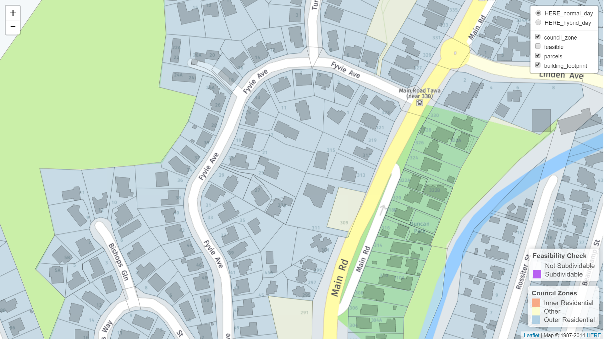
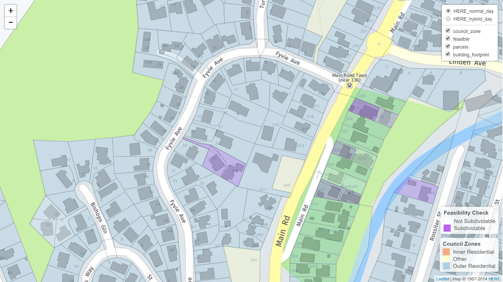

## Simplocation

Simplification of Data visualisation for land sub-division based on location within New Zealand regions (e.g. Wellington region).
Shows what is feasible to subdivide based on section area, building footprint, council zoning and district plan rules.
https://2017.hackerspace.govhack.org/project/simplocation 

# Before Feasibility filter applied

# After feasiblity filter applied

# Datasources:

* HERE MAPs API for base map (hybrid day)
* HERE MAPs API for base map (normal day)
* LINZ Parcels
* Wellington City Council (zoning map)
* Wellington City Council (building footprints)
* Wellington City council district plan rules

# Background
THERE IS NO MAGIC BULLET THAT WILL SOLVE THE HOUSING CRISIS.

Housing supply needs to increase so that more people can own a home for the first time.

 

Simplocation is useful for:

Existing homeowners - people with mortgages;
Property buyers and developers; and
Professionals

#------------------------------------------------------------------------------
